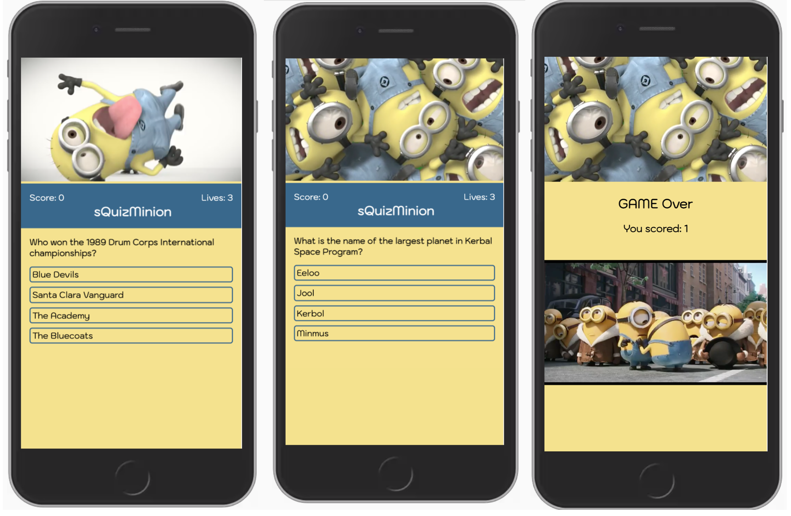

# sQuizMinion
---

---
## Be quizzed by minions!
If you don't like minions, look away now. This app was taken over by these little creatures. The quiz starts by minions fired at the screen. The player is given 3 lives. Every time the player gets the answer right - minions cheer, if the answer is wrong - minions blow a raspberry. When the game is lost, minions will cry inconsolably. Oh well, better luck next time. Just don't forget to have the volume up so you can hear the little guys.

## Installation and set up

- Clone the project and run `npm install`
- Run `npm build` 
- Copy and past the index.html path into your browser

## Technologies used:

- React
- Redux
- SCSS
- API: Open Trivia Database (https://opentdb.com/)

---
